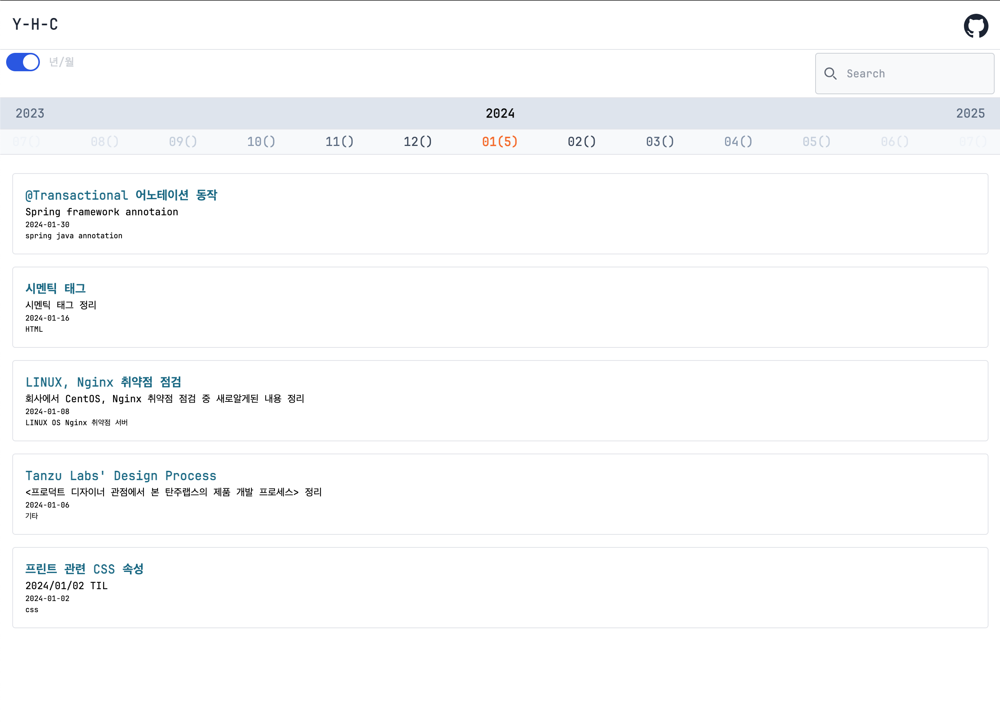

# log

-   next.js를 이용한 블로그 템플릿
-   코드 블럭 지원

### 기술스택


### 환경

-   node version >= 16.0.0v (18v 사용권장, 배포 시 18v 사용)

### 설치

```bash
npm install
```

### 실행

```bash
npm run dev
```

### 배포

-   main 브랜치 push -> vercel 배포

### 화면

| 로그인 화면                    | 로그인(검증) 화면              | TODO 입력화면                  |
| ------------------------------ | ------------------------------ | ------------------------------ |
|  |  |  |
